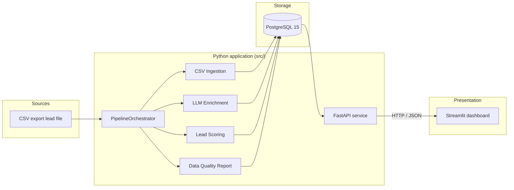
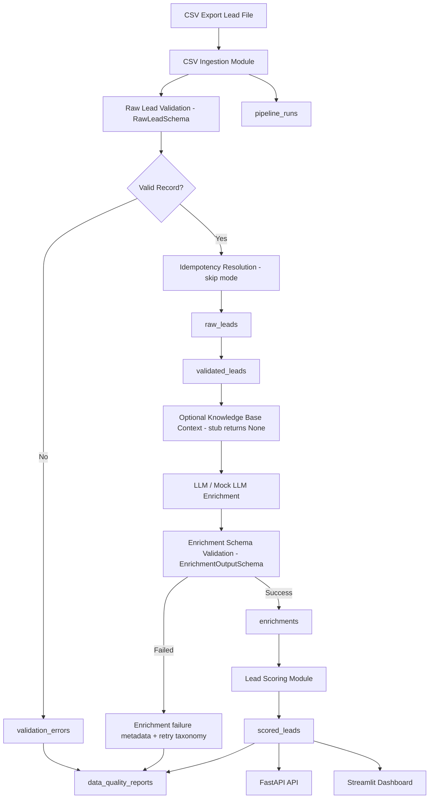
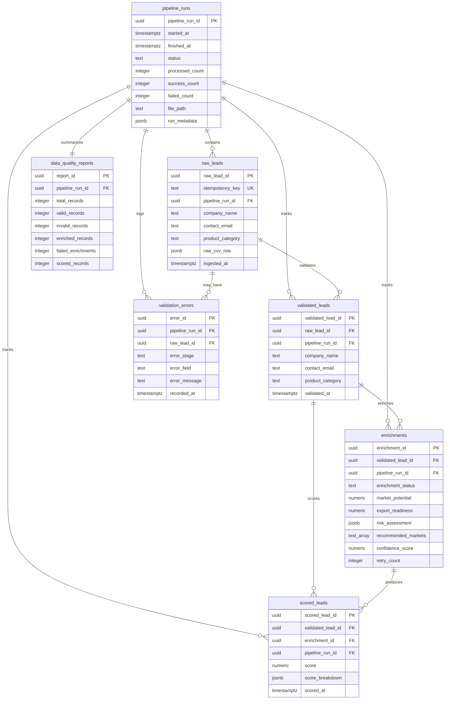
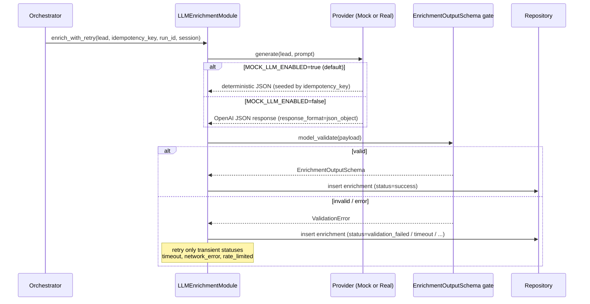
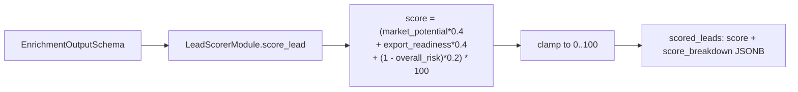
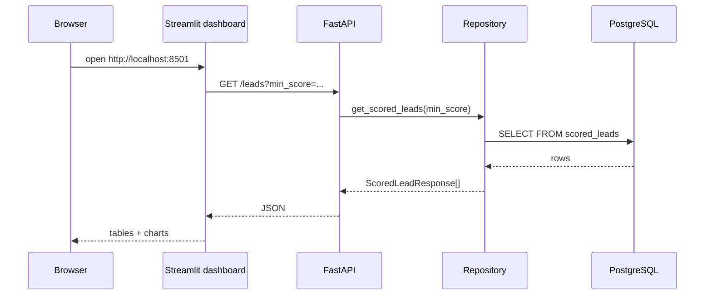
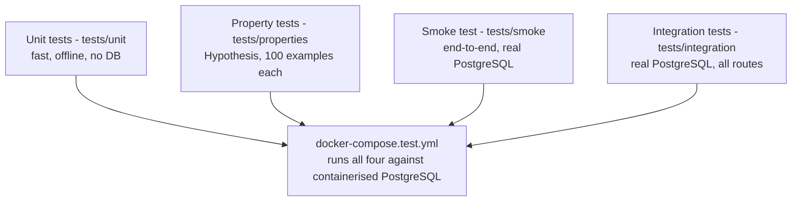
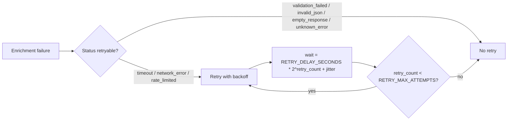
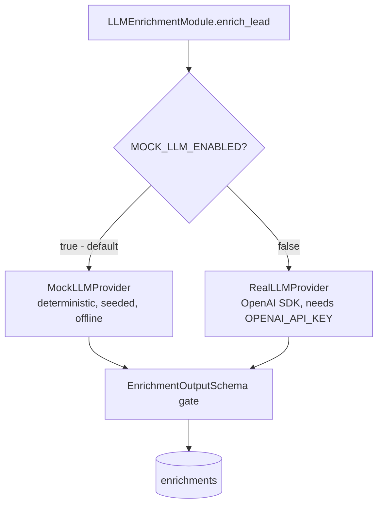

# Architecture — AI Export Intelligence Pipeline

Detailed architecture notes for the spec-driven AI/data pipeline that validates,
enriches and scores export leads. This document complements the high-level
overview in the [README](../README.md) with component-level interaction
diagrams, the database model, and the design decisions behind enrichment,
scoring, idempotency and the mock-vs-real LLM boundary.

> **Scope honesty.** This is a portfolio-grade, production-*oriented*
> architecture — clean module boundaries, dependency injection, a real
> relational schema and a layered test pyramid. It is **not** a deployed
> production SaaS: there is no authentication, no cloud infrastructure, no
> Kubernetes, no CI/CD, no vector database / RAG, and no monitoring or alerting.
> Those are listed under [Known limitations](#known-limitations).

---

## Table of contents

1. [System overview](#system-overview)
2. [Data flow](#data-flow)
3. [Component responsibilities](#component-responsibilities)
4. [Database model overview](#database-model-overview)
5. [Enrichment flow](#enrichment-flow)
6. [Scoring flow](#scoring-flow)
7. [API and dashboard flow](#api-and-dashboard-flow)
8. [Testing architecture](#testing-architecture)
9. [Idempotency and retry design](#idempotency-and-retry-design)
10. [Mock vs real LLM design](#mock-vs-real-llm-design)
11. [Known limitations](#known-limitations)

---

## System overview

The system is a single Python application organised into clear layers. The
pipeline (ingestion → enrichment → scoring) writes to PostgreSQL; a FastAPI
service reads from PostgreSQL; and a read-only Streamlit dashboard reads from the
FastAPI service over HTTP. The dashboard never touches the database directly.

Key properties:

- **Dependency injection everywhere.** The orchestrator, enrichment module,
  scorer and data-quality reporter all accept their collaborators (session
  factory, repository, providers, clock, uuid factory) as constructor / call
  arguments. Production defaults are built lazily, never at import time, so
  importing any module has no side effects and reads no configuration.
- **One session per run.** The orchestrator opens exactly one database session
  and reuses it for ingestion, every enrichment and every scoring call.
- **Mock-first.** With `MOCK_LLM_ENABLED=true` (the default) the entire pipeline
  runs deterministically with no API key, no network and no external service.

---

## Data flow

Stage-by-stage:

1. **Ingestion.** `ingest_csv_file` reads each row with `csv.DictReader`,
   generates a deterministic idempotency key, and validates the row against
   `RawLeadSchema`. Valid rows are written to `raw_leads` **and**
   `validated_leads`; invalid rows are recorded in `validation_errors` and go no
   further. A row whose idempotency key was already ingested is counted as
   `skipped` (skip-mode duplicate handling).
2. **Enrichment.** For each validated lead, the orchestrator calls
   `enrich_with_retry`. The selected provider (mock or real) produces a JSON
   payload that must pass the `EnrichmentOutputSchema` validation gate before it
   is stored as a successful `enrichments` row. Failures are classified into a
   status taxonomy and stored with error metadata.
3. **Scoring.** Only successfully enriched leads are scored. The weighted score
   and a `score_breakdown` are written to `scored_leads`.
4. **Reporting.** After all leads are processed, `generate_report` counts each
   stage and writes one `data_quality_reports` row.
5. **Serving.** FastAPI exposes the scored leads and reports; the dashboard
   renders them.

---

## Component responsibilities

| Component | Module | Responsibility |
|---|---|---|
| Configuration | `src/config.py` | `pydantic-settings` env config; `DATABASE_URL` required, sensible defaults for everything else |
| Validation schemas | `src/validation/` | `RawLeadSchema` (input) and `EnrichmentOutputSchema` (LLM output gate) |
| Idempotency | `src/ingestion/idempotency.py` | Deterministic SHA-256 business-identity key |
| CSV ingestion | `src/ingestion/csv_ingestion.py` | Parse, validate, persist valid/invalid rows; skip duplicates |
| Mock LLM | `src/enrichment/mock_llm.py` | Deterministic, schema-valid synthetic enrichment (seeded by idempotency key) |
| Real LLM | `src/enrichment/real_llm.py` | Optional OpenAI provider (JSON output mode), built lazily |
| Prompt builder | `src/enrichment/prompt_builder.py` | Deterministic prompt text including lead fields + output contract |
| Retry policy | `src/enrichment/retry_policy.py` | Pure classification of the failure taxonomy |
| Enrichment module | `src/enrichment/llm_enrichment.py` | Provider selection, validation gate, failure mapping, retry loop |
| Knowledge base | `src/knowledge_base/kb_module.py` | Stub — `retrieve_context` returns `None`; `is_enabled` reads `KB_ENABLED` |
| Scoring | `src/scoring/lead_scorer.py` | Weighted 0–100 score with breakdown |
| Orchestrator | `src/pipeline/orchestrator.py` | Run lifecycle, single session, per-lead isolation |
| Data quality | `src/pipeline/data_quality.py` | Per-stage row counts → one report row |
| Repository | `src/database/repository.py` | All CRUD; session injected, no global state |
| ORM / session | `src/database/models.py`, `session.py` | SQLAlchemy 2.0 models and lazy session factory |
| API | `src/api/` | FastAPI app + read-only routes |
| Dashboard | `dashboard/app.py` | Streamlit read-only views over the API |

---

## Database model overview

Seven core tables, created by `migrations/001_initial_schema.sql` (every
statement is `IF NOT EXISTS`, so the migration is idempotent).

| Table | Purpose |
|---|---|
| `pipeline_runs` | Tracks each pipeline execution and its terminal status + counts |
| `raw_leads` | Deduplicated raw lead records (unique `idempotency_key`) |
| `validated_leads` | Schema-valid lead records |
| `enrichments` | LLM/mock enrichment outputs and failure metadata |
| `scored_leads` | Final scored leads (denormalised `company_name` / `product_category`) |
| `data_quality_reports` | Run-level quality metrics |
| `validation_errors` | Per-field validation failures |

---

## Enrichment flow

The **validation gate** is the architectural heart of enrichment: both the mock
and real providers converge on the same `EnrichmentOutputSchema.model_validate`
call. Nothing reaches the `enrichments` table as `success` unless it satisfies
the schema (floats in `[0, 1]`, a `risk_assessment` with `overall_risk`, a
`recommended_markets` list). Failures are mapped onto a status taxonomy:
`success`, `validation_failed`, `empty_response`, `invalid_json`,
`timeout`, `network_error`, `rate_limited`, `unknown_error`.

---

## Scoring flow

- Missing or invalid components default to `0.0` for that component.
- The result is clamped to `[0, 100]` (a property test asserts this universally).
- `score_breakdown` records each weighted component so the score is explainable.

---

## API and dashboard flow

Endpoints (all read-only):

| Method | Path | Purpose |
|---|---|---|
| `GET` | `/health` | Liveness probe → `{"status": "ok"}` |
| `GET` | `/leads` | List scored leads, optional `min_score` |
| `GET` | `/leads/filter?min_score=` | Explicit filter endpoint |
| `GET` | `/leads/{lead_id}` | Single scored lead (404 if missing) |
| `GET` | `/pipeline-runs` | All runs, newest first |
| `GET` | `/pipeline-runs/{run_id}/report` | Run's data quality report (404 if missing) |

The dashboard is **read-only** and **depends on FastAPI data availability**: it
calls the endpoints with `requests` and shows a friendly message (not a stack
trace) when the API is unreachable. It makes no API call at import time and
never connects to the database directly.

---

## Testing architecture

- **Unit** (`tests/unit/`) — pure logic with injected fakes; no PostgreSQL, no
  network, no OpenAI key. **435 passed** locally.
- **Property** (`tests/properties/`) — six universal properties exercised with
  100 generated examples each via Hypothesis; fully offline. **23 passed**.
- **Smoke** (`tests/smoke/`) — runs the whole pipeline against a real local
  PostgreSQL; **skipped** unless `SMOKE_TEST_DATABASE_URL` is set.
- **Integration** (`tests/integration/`) — real components against a real
  PostgreSQL; **skipped** unless `DATABASE_URL` is set. The live OpenAI test is
  skipped unless `OPENAI_API_KEY` **and** `RUN_LIVE_LLM_TESTS=true` are both set.

The containerised full suite (`docker-compose.test.yml`) runs unit + property +
smoke + integration together against a dedicated PostgreSQL: **474 passed, 3
skipped** (the 3 skips are the live-LLM tests that need a real key).

---

## Idempotency and retry design

**Idempotency key.** `generate_idempotency_key` builds a deterministic SHA-256
hash from the lead's *business identity* — `company_name`, `contact_email`,
`product_category` and `target_market` — after normalising whitespace, casing
and empty/missing values. The same logical lead always produces the same key.

**Skip mode (implemented).** When a validated row's idempotency key already
exists in `raw_leads` (which has a unique constraint on `idempotency_key`), the
row is counted as `skipped` instead of being inserted again. This keeps a re-run
from crashing on the unique constraint.

> **Not implemented yet:** `update` and `reprocess` idempotency modes. The
> `IDEMPOTENCY_MODE` setting exists and defaults to `skip`; only `skip` is wired
> up. Documenting these honestly matters — they are future work, not current
> behaviour.

**Retry taxonomy.** Enrichment failures are classified by `retry_policy`:

Only transient statuses are retried; `retry_count` is incremented in the
database and never exceeds `RETRY_MAX_ATTEMPTS` (a property test asserts the
ceiling). Sleep/backoff are injectable so tests run with no real delay.

---

## Mock vs real LLM design

- **Mock is the default** (`MOCK_LLM_ENABLED=true`). The mock provider returns a
  deterministic, schema-valid payload seeded by the lead's idempotency key — the
  full pipeline runs, is tested and is demoed with **no OpenAI key**, no network
  and no cost.
- **Real is optional** (`MOCK_LLM_ENABLED=false`). `RealLLMProvider` uses the
  OpenAI SDK with `response_format={"type": "json_object"}`, reads
  `OPENAI_API_KEY` / `OPENAI_MODEL` from config, builds the client lazily (never
  at import time), and records the actual model from the API response. Real mode
  fails clearly if `OPENAI_API_KEY` is missing.
- **`OPENAI_API_KEY` is not required** for the default demo, the unit/property
  tests, Docker, or the smoke/integration suites.
- The single validation gate means both providers are interchangeable — the rest
  of the pipeline cannot tell which one ran.

---

## Known limitations

These are deliberately **not** implemented and are documented here so the
architecture is not oversold:

- **No real knowledge base / RAG.** `KnowledgeBaseModule.retrieve_context`
  returns `None`; there is no vector database, embeddings or retrieval.
- **Idempotency:** only `skip` mode. `update` and `reprocess` are not wired up.
- **No authentication / authorisation** on the API or dashboard.
- **No cloud infrastructure, Kubernetes, CI/CD, monitoring or alerting.**
- **No real buyer/seller data or matching** — all sample data is synthetic and
  fictional (`.example` domains).
- **Dashboard is read-only** and depends on the FastAPI service being up.
- **Real OpenAI mode is opt-in**, not the default; the live LLM test is skipped
  by default.

See the README's *Future Enhancements* section for the roadmap.
